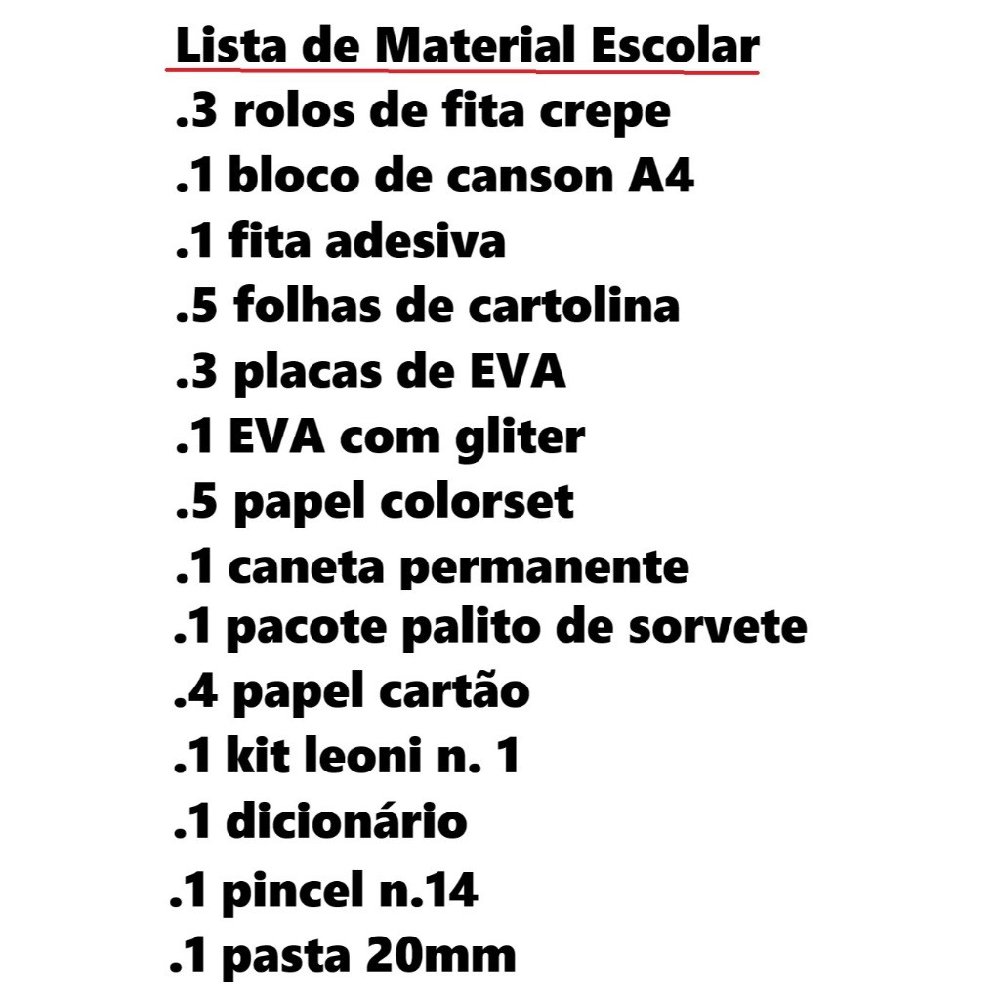
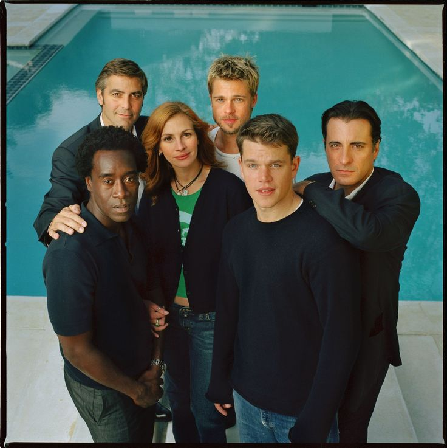
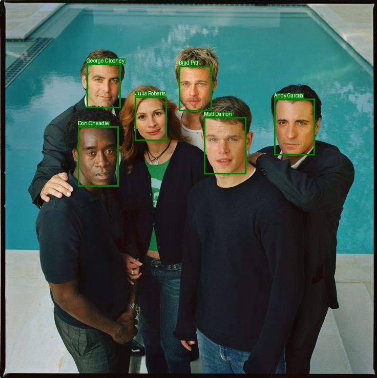

# Curso-NEXA_DIO.ME
Trabalhos do curso: Nexa - Análise Avançada de Imagens e Texto com IA na AWS

  
  
  
  
  

Este Projeto foi realizado por Maurício André de Almeida como trabalho no curso DIO.ME Nexa - Análise Avançada de Imagens e Texto com IA na AWS

❔Configuração do ambiente
É necessário configurar um usuário no IAM com acesso aos serviços Textract e Rekognition.

<h2>Projeto de uso do Textract para OCR:</h2>

O projeto consiste em submeter uma imagem para o serviço AWS Textract e realizar o reconhecimento ótico de caracteres.

📸<b>Imagem utilizada para o teste:</b> 

📸<b>Texto reconhecido:</b> 

-  Texto reconhecido para o arquivo: ./Images/lista-material-escolar.jpg
-  =======================================================================
  - Linhas de texto reconhecidas:
    - Lista de Material Escolar
    - .3 rolos de fita crepe
    - .1 bloco de canson A4
    - .1 fita adesiva
    - .5 folhas de cartolina
    - .3 placas de EVA
    - .1 EVA com gliter
    - .5 papel colorset
    - .1 caneta permanente
    - .1 pacote palito de sorvete
    - .4 papel cartão
    - .1 kit leoni n. 1
    - .1 dicionário
    - .1 pincel n.14
    - .1 pasta 20mm

<h2>Projeto de uso do Rekognition para identificar celebridades:</h2>

O projeto consiste em submeter algumas imagens para o serviço AWS Rekognition e realizar o reconhecimento e identificação das celebridades na foto.

📸<b>Imagem utilizada para o teste:</b> 

📸<b>Imagem processada:</b> 

✔️ Técnicas e tecnologias utilizadas

   - Python
   - Boto3
   - AWS Textract
   - AWS Recognition
   
📁 Acesso ao projeto

   - Você pode baixar os arquivos do projeto clicando [aqui](https://github.com/mauricioaalmeida/Curso-NEXA_DIO.ME/archive/refs/heads/main.zip)
   

# Autor

[  Mauricio Andre de Almeida](https://github.com/mauricioaalmeida) 
